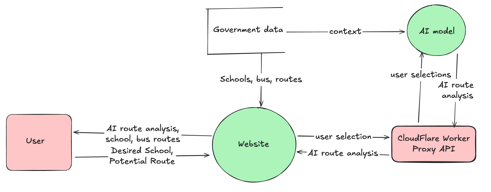

 
# [SchoolRoute](https://cobaltbluetarantula.github.io/SchoolRoute/)
## 🧠 Smarter, Safer, and Future-Ready School Transport System

**Challenge:** Optimising Transport Networks for School Kids  
**Team:** Shadow Mantle  
**Project Type:** Web Application  
**Focus:** Student experience, public transport accessibility, data-driven planning, and future transport innovation

## 🚀 Our Solution

SchoolRoute is a student-first, data-driven web application that empowers students, families, and planners with intelligent insights into school transport. It provides real-time and historical data on bus route reliability, accessibility, and usage—making school travel safer, more predictable, and more efficient. 

Implementation of an AI chatbot provides user-friendly, succinct information that is easily digestible for students, which prioritises the safety and reliability of different bus routes to aid student decision making.

## ⚡ Features

* Smart Route Finder  
  Students and parents can enter their address and desired arrival time to receive tailored school bus route suggestions.  
* Reliability Analyzer  
  Our AI model shows how consistent a route is—highlighting whether it tends to be early, late, or on time.  
* Crowdedness Estimator  
  Using student distance data and route mapping, we estimate how busy a route is likely to be during specific time windows.  
* Planning Feedback Loop  
  Route performance data is packaged for schools and transport authorities to identify gaps, inefficiencies, and areas for improvement.

## ❗ Impact

**For Students & Families:**

* Reduces stress and uncertainty around school travel  
* Promotes independence and confidence in using public transport  
* Encourages sustainable travel habits

**For Schools & Planners:**

* Provides actionable insights into route performance and demand  
* Supports data-driven decision-making for future infrastructure  
* Helps reduce congestion and improve safety around schools

**For Communities:**

* Reduces environmental impact through smarter transport planning  
* Builds a foundation for future-ready, AI-enhanced public services

## ☁️ Data Usage

## 📎 Dataset information

### 1\. [Australian School List from Peclet Technology](https://data.peclet.com.au/explore/dataset/australian-schools-list/table/)

This publicly available dataset provided us with detailed information for each school in the ACT, including the school name, type, sector, state, postcode and location.  
This data was filtered to only include schools within the ACT and plotted on a map using the provided coordinates. This comprehensive dataset also provided us with the required search completions for our web application, allowing users to quickly find their school.  
Additionally, the data of the school selected by the user was used as context for the AI model, helping it assess the route more effectively.

### 2\. [ACT School Bus Services](https://www.data.gov.au/data/dataset/p4rg-3jx2)

This government dataset contains a list of all the school bus services in ACT, which we organised in a table on our website. We also implemented search capability, making it an easily accessible way of looking up service data effectively.

### [ACT Public Bus Routes](https://www.data.gov.au/data/dataset/ifm8-78yv)

This data was essential for us, as it contained an array of longitude and latitude coordinates for every public bus route in the ACT. Before using the data, we had to convert it into a format that could be plotted on a map.
This meant that we had to parse a WKT MULTISTRING (Well-known text representation of geometry) into an array of [longitude, latitude] arrays. After doing this, we could utilise this extensive dataset by plotting route coordinates as polylines on a map to display the routes.

# Check it out
The website is abailable [here](https://cobaltbluetarantula.github.io/SchoolRoute/).
 
 
**Note:** Due to limitations in our hosting capabilities, it is possible that the model might not always be accessible, meaning that full uptime is not guaranteed.